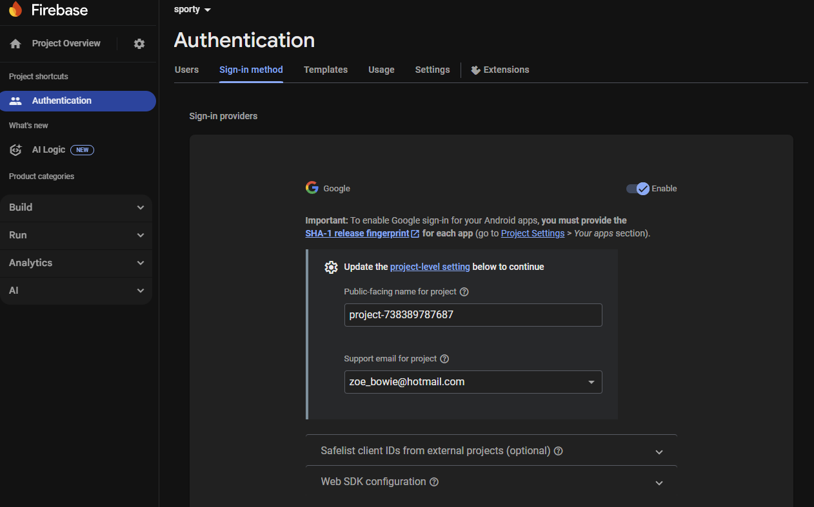

# Basketball Club Management App

A React-based web application for managing basketball club activities, built with Firebase backend and deployable to GitHub Pages.

## Features

- 🏠 Public home page with latest posts
- 📅 Public calendar with team/age filters
- 👤 User authentication and team management
- 💬 Team-specific messaging and posts
- 🔐 Admin panel for club management
- 📱 Responsive design for mobile/desktop

## Tech Stack

- **Frontend**: React 18, React Router, React Calendar
- **Backend**: Firebase (Firestore, Authentication, Analytics)
- **Hosting**: GitHub Pages (frontend) + Firebase (backend services)
- **Deployment**: GitHub Actions

## Prerequisites

- Node.js 16+ and npm
- Git
- Firebase account
- GitHub account

## Local Development Setup

### 1. Clone and Install

```bash
git clone https://github.com/yourusername/sporty.git
cd sporty
npm install
```

### 2. Firebase Setup

1. Go to [Firebase Console](https://console.firebase.google.com)
2. Create a new project
3. Enable the following services:
   - **Authentication** → Sign-in method → Google (enable and configure)
   - **Firestore Database** → Create database (start in test mode)
   - ~~**Storage** → Get started~~ (Optional - requires billing upgrade)
4. **Configure Google Sign-In**:
   - In Authentication → Sign-in method → Google
   - Click "Enable"
   - Add your domain (yourusername.github.io) to authorized domains
   - Note down the Web client ID for later use
5. Go to Project Settings → General → Your apps
6. Click "Web app" icon and register your app
   - **Do NOT check** "Also set up Firebase Hosting for this app"
   - We're using GitHub Pages for hosting instead
7. Copy the Firebase config object

**Note**: Firebase Storage is optional and requires a billing plan upgrade. For now, you can use external image hosting services like:
- [Imgur](https://imgur.com) - Free image hosting
- [Cloudinary](https://cloudinary.com) - Free tier available
- Store image URLs directly in Firestore instead of uploading files

### 3. Environment Configuration

Update `src/firebase.js` with your Firebase config:

```javascript
const firebaseConfig = {
  apiKey: "your-actual-api-key",
  authDomain: "your-project.firebaseapp.com",
  projectId: "your-project-id",
  storageBucket: "your-project.appspot.com",
  messagingSenderId: "123456789",
  appId: "your-app-id"
};
```

**Important**: For Google Sign-In to work on GitHub Pages, add your domain to Firebase:
- Go to Authentication → Settings → Authorized domains
- Add: `yourusername.github.io`

### 4. Firestore Security Rules

In Firebase Console Build → Firestore Database → Rules tab, update with:

```javascript
rules_version = '2';
service cloud.firestore {
  match /databases/{database}/documents {
    // Function to check if user is admin
    function isAdmin() {
      return request.auth != null && 
        get(/databases/$(database)/documents/users/$(request.auth.uid)).data.role == 'admin';
    }
    
    // Users can read/write their own user document
    // Admins can read all user documents
    match /users/{userId} {
      allow read: if request.auth != null && 
        (request.auth.uid == userId || isAdmin());
      allow write: if request.auth != null && 
        (request.auth.uid == userId || isAdmin());
    }
    
    // Public posts are readable by everyone
    match /posts/{postId} {
      allow read: if resource.data.isPublic == true;
      allow write: if request.auth != null;
    }
    
    // Team posts are readable by team members
    match /teams/{teamId}/posts/{postId} {
      allow read, write: if request.auth != null && 
        request.auth.uid in get(/databases/$(database)/documents/teams/$(teamId)).data.members;
    }
    
    // Teams are readable by authenticated users
    // Admins can write to all teams
    match /teams/{teamId} {
      allow read: if request.auth != null;
      allow write: if request.auth != null && 
        (get(/databases/$(database)/documents/users/$(request.auth.uid)).data.role in ['admin', 'manager'] ||
         request.auth.uid in resource.data.managers);
    }
    
    // Public events are readable by everyone
    match /events/{eventId} {
      allow read: if resource.data.isPublic == true;
      allow write: if request.auth != null;
    }
  }
}
```

### 5. Run Locally

```bash
npm start
```

The app will open at `http://localhost:3000`

**Note**: Google Sign-In requires HTTPS in production but works on localhost for development.

### 6. Create First Admin User

After setting up Firebase and running the app locally:

1. **Sign in with Google** through your app
2. **Go to Firebase Console** → Firestore Database → Data tab
3. **Find your user document** in the `users` collection
4. **Edit the document** and change the `role` field from `"member"` to `"admin"`
5. **Save the changes**

**Alternative method using Firebase Console:**
```javascript
// In Firestore, manually create an admin user document:
users/{your-user-uid}/
{
  name: "Your Name",
  email: "your-email@gmail.com", 
  role: "admin",  // Change this to "admin"
  teams: [],
  createdAt: new Date()
}
```

**Future admins can be promoted by existing admins through the Admin Panel.**

## Deployment

### Initial Setup

1. **Update package.json homepage**:
   ```json
   "homepage": "https://yourusername.github.io/sporty"
   ```

2. **Create GitHub repository** and push your code

3. **Enable GitHub Pages**:
   - Go to repository Settings → Pages
   - Source: Deploy from a branch
   - Branch: Select `main` (the `gh-pages` branch will be created automatically when you deploy)
   - Folder: Select `/ (root)` from the second dropdown that appears
   - Click Save

**Note**: The `gh-pages` branch will be created automatically when you first run `npm run deploy` or when GitHub Actions runs.

### Deploy Changes

The app auto-deploys when you push to the `main` branch via GitHub Actions.

**Manual deployment**:
```bash
npm run deploy
```

## Project Structure

```
src/
├── components/          # Reusable React components
│   ├── Navbar.js       # Navigation bar
│   └── PostCard.js     # Post display component
├── pages/              # Main page components
│   ├── Home.js         # Public homepage
│   ├── Calendar.js     # Public events calendar
│   ├── Login.js        # Authentication
│   ├── Dashboard.js    # User dashboard (to be created)
│   ├── TeamArea.js     # Team-specific area (to be created)
│   └── AdminPanel.js   # Admin management (to be created)
├── firebase.js         # Firebase configuration
├── App.js             # Main app component with routing
├── App.css            # Global styles
└── index.js           # React entry point
```

## Firebase Data Structure

```
users/
  {userId}/
    name: string
    email: string
    role: 'admin' | 'manager' | 'member'  // admin can create teams
    teams: [teamId]
    createdAt: timestamp

teams/
  {teamId}/
    name: string
    ageRange: string
    members: [userId]
    managers: [userId]
    createdBy: userId  // admin who created the team
    createdAt: timestamp

posts/
  {postId}/
    title: string
    content: string
    imageUrl?: string  // External URL (Imgur, Cloudinary, etc.)
    authorId: string
    authorName: string
    isPublic: boolean
    teamId?: string
    createdAt: timestamp

events/
  {eventId}/
    title: string
    description: string
    date: timestamp
    teamId?: string
    ageRange?: string
    isPublic: boolean
```

## Development Workflow

### Adding New Features

1. Create feature branch: `git checkout -b feature/your-feature`
2. Make changes and test locally
3. Commit: `git commit -m "Add: your feature description"`
4. Push: `git push origin feature/your-feature`
5. Create Pull Request
6. Merge to main triggers auto-deployment

### Environment Variables (Future)

For sensitive config, create `.env.local`:
```
REACT_APP_FIREBASE_API_KEY=your-key
REACT_APP_FIREBASE_AUTH_DOMAIN=your-domain
# ... other config
```

Then update `firebase.js` to use `process.env.REACT_APP_*`

## Troubleshooting

### Build Errors
- Check Node.js version (16+)
- Delete `node_modules` and run `npm install`
- Clear npm cache: `npm cache clean --force`

### Firebase Issues
- Verify config in `firebase.js`
- Check Firebase console for enabled services
- Ensure Firestore rules allow your operations
- **Storage not required**: Use external image hosting for now to avoid billing

### Deployment Issues
- Check GitHub Actions tab for build logs
- Verify homepage URL in `package.json`
- Ensure `gh-pages` branch exists
- **Package lock sync error**: Delete `package-lock.json` locally, run `npm install`, then commit and push

### Google Sign-In Issues
- Verify Google provider is enabled in Firebase Authentication
- Check that your domain is in authorized domains list
- Ensure you're using HTTPS in production (GitHub Pages provides this)

## Available Scripts

- `npm start` - Run development server
- `npm run build` - Create production build
- `npm run deploy` - Deploy to GitHub Pages
- `npm test` - Run test suite

## Notes if we keep:
1. change the support email listed in firebase when I enabled google authentication:

2. **Firebase Storage**: Currently skipped to avoid billing charges. Images can be hosted externally and URLs stored in Firestore.
3. **First Admin Setup**: Manually change the first user's role to "admin" in Firestore Console after they sign up.

## Contributing

1. Fork the repository
2. Create your feature branch
3. Commit your changes4. Push to the branch5. Create a Pull Request## LicenseThis project is licensed under the MIT License.